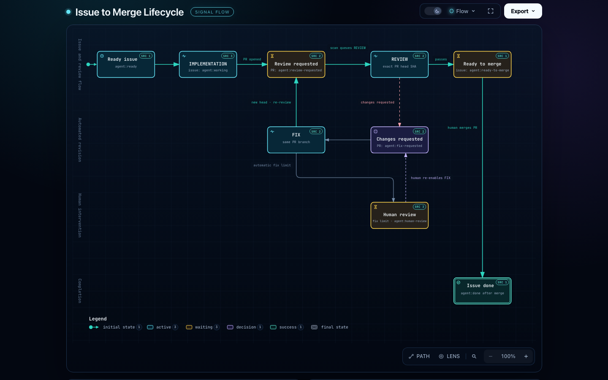
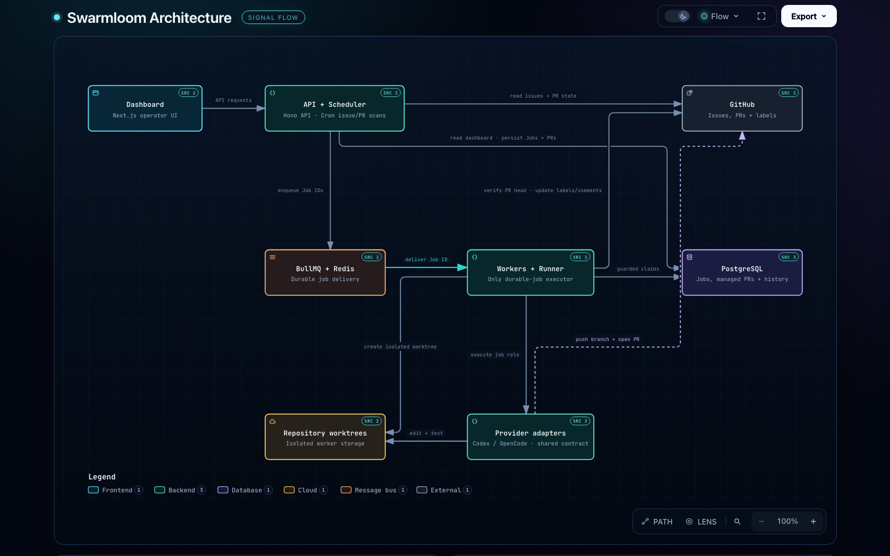

  

  Self-hosted agents that turn GitHub work into a visible, reviewable delivery loop.

# Swarmloom

Swarmloom is an orchestration layer for autonomous software work. It watches configured GitHub
repositories, turns labelled issues into durable jobs, gives each job an isolated worktree, and
coordinates implementation, review, and fixes through the GitHub issues and Pull Requests people
already use.

The result is a workflow that stays asynchronous and inspectable: agents do one job at a time,
GitHub labels and comments show the current state, and a human makes the final merge decision.

## Why Swarmloom

An agent can write a patch quickly, but a useful software workflow also needs durable coordination,
repeatable review, and an obvious place to investigate failures. Swarmloom connects those pieces
without hiding them behind an opaque conversation:

- **Queue the right work.** Add `agent:ready` to an issue and the scheduler acquires it once.
- **Keep changes isolated.** Each implementation starts from the captured `origin/develop` commit
  in its own branch and persistent Git worktree.
- **Review the exact change.** Every managed PR gets an independent review for its current head
  SHA. Review feedback can queue a fix on the same branch.
- **Preserve human control.** A passing review makes a PR ready to merge; Swarmloom never merges
  it automatically.
- **Keep evidence durable.** BullMQ and Redis deliver jobs, while PostgreSQL records business
  state, history, events, settings, and review results.

## How it works

The lifecycle is driven by GitHub state. Each scanner observes the current issue or PR labels,
records a durable job, and lets a worker perform the work asynchronously.

The previews link to self-contained Archify diagrams. Open the linked HTML files locally to use the
interactive viewer; GitHub displays static images in README pages and does not run embedded HTML.

[Open the interactive lifecycle diagram](docs/diagrams/issue-to-merge.html).

1. A repository issue receives `agent:ready`.
2. The issue scanner queues an `IMPLEMENTATION` job. The worker creates a branch and worktree,
   runs the selected provider, verifies the result, and opens a PR targeting `develop`.
3. The PR scanner queues a `REVIEW` job for the exact PR head SHA. A passing review marks the PR
   `agent:review-passed` and the issue `agent:ready-to-merge`.
4. A review that requests changes marks the PR `agent:fix-requested`; a `FIX` job updates the same
   branch and sends it back through review. A configurable safety limit can stop the loop for
   human intervention.
5. A human merges the reviewed PR. The scanner then marks the originating issue `agent:done`.

Implementation, fix, and review are independent jobs. No agent starts another agent
directly, and a failed or stale job remains visible in the dashboard and event history.

## Architecture

Swarmloom has one TypeScript application split into API/scheduler, worker, and dashboard roles.
The scheduler reconciles GitHub; BullMQ provides delivery and locking; workers claim jobs with
guarded PostgreSQL transitions; provider adapters keep Codex and OpenCode behind the same contract.
Coding models handle implementation and fixes; review models are configured
independently for pull request reviews.

[Open the interactive architecture diagram](docs/diagrams/swarmloom-architecture.html).

PostgreSQL is the durable business-state and history authority. Redis/Valkey is the BullMQ delivery
authority. Local Compose provisions Redis; production deployments use externally managed PostgreSQL
and Redis/Valkey. Repository clones and worktrees live in worker storage, while the dashboard and
optional Telegram notifications expose operational state without changing the workflow authority.

## Core concepts

| Concept | Meaning |
|---|---|
| **Labels** | The human-visible coordination protocol for issue and PR state. |
| **Jobs** | Durable units of `IMPLEMENTATION`, `FIX`, or `REVIEW` work. |
| **Workers** | The only process that claims and executes durable jobs. |
| **Providers** | Codex and OpenCode adapters with independent coding and review models behind one provider-independent contract. |
| **Evidence** | PRs, comments, reviews, events, logs, and PostgreSQL history used to understand a run. |

## Boundaries that matter

- Every target repository must provide an `origin/develop` branch. Swarmloom does not fall back to
  `main`, `master`, or a repository's default branch.
- Automated work may create branches and Pull Requests, but merging remains a human action.
- Provider credentials stay in their runtime auth volumes. Telegram credentials entered in Settings
  are encrypted before persistence and are never returned by the API.
- The scheduler does not execute jobs inline. It records and enqueues them; workers perform the
  guarded state transition and execution.

## Deployment

Swarmloom runs as a Docker Compose application. The complete guide covers prerequisites, local
development, provider authentication, environment variables, first deployment, operations,
backups, updates, and troubleshooting.

Read the [deployment and operations guide](docs/DEPLOYMENT.md) before running an instance.

## Codex model catalog

When Codex is selected, Settings provides separate catalog-backed model selectors for coding and
review jobs. The catalog contains GPT-5.6 Luna (`gpt-5.6-luna`), GPT-5.6 Terra (`gpt-5.6-terra`),
GPT-5.6 Sol (`gpt-5.6-sol`), GPT-6 Astra (`gpt-6-astra`), GPT-6 Sol (`gpt-6-sol`), and GPT-6 Luna
(`gpt-6-luna`). The GPT-5.6 models, GPT-6 Sol, and GPT-6 Luna expose `none`, `low`, `medium`,
`high`, `xhigh`, and `max`; Astra exposes `low`, `medium`, `high`, `xhigh`, and `max`.

The `CODEX_*` environment variables are bootstrap values and must match the catalog. New jobs keep
the selected provider, model, and reasoning effort snapshot even after Settings changes. OpenCode
model settings remain free text.

## Documentation

- [Deployment and operations](docs/DEPLOYMENT.md) — setup, authentication, configuration,
  deployment, backups, updates, and troubleshooting.
- [Contributing](CONTRIBUTING.md) — development and Pull Request conventions.
- [Design](DESIGN.md) — dashboard design direction and accessibility principles.
- [Changelog](CHANGELOG.md) — released changes.
- [Code of Conduct](CODE_OF_CONDUCT.md) — community expectations.

## License

See [LICENSE](LICENSE).
